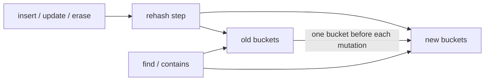

# Week 4: Incremental HashTable and Rehash

## Outcome

Week 4 replaced the top-level `std::unordered_map<std::string, Value>` in `Database` with the
project's `HashTable<std::string, Value>`. The storage API remained `set`, `find`, `erase`, and
`exists`, so bucket layout and rehash state did not leak into the command layer.

The work was complete only after three separate questions had answers:

1. Does the table preserve map semantics during migration?
2. Does the server still preserve its command and RESP behavior after integration?
3. Does incremental migration measurably reduce rehash tail latency in the chosen workload?

## Data Structure

`HashTable` uses separate chaining. Each table is a vector of list buckets, and each list owns
`Entry { key, value }` nodes. Rehash state consists of the old table, a new table, and
`rehash_index_`, the next old bucket to migrate.

Growth starts before an insertion would exceed the maximum load factor. The new bucket array is
allocated immediately, but existing entries remain in the old table. Before each mutation, one
entire old bucket is moved into the new table using list splicing. When every old bucket has been
moved, the new table becomes the only table.

Reads deliberately do not advance migration. This keeps logically const operations const and makes
rehash progress depend only on mutations. During migration, lookup checks the new table first and
then the old table. New keys always enter the new table.

Explicit `reserve` or `rehash` calls finish an active migration before starting another one. The
implementation therefore supports one old/new migration pair, not nested migrations.

## Invariants

The implementation and tests rely on these invariants:

- `size_` counts entries across both tables exactly once.
- A key has at most one live entry across the old and new tables.
- Buckets with indexes below `rehash_index_` in the old table are empty.
- During migration, new keys are inserted into the new table.
- Lookup and erase search both tables, so an entry remains reachable until migration completes.
- `rehash_progress()` is `1.0` while idle and otherwise reflects migrated old buckets.

These rules are the correctness boundary. The fact that migration is incremental is a performance
property; preserving these invariants is what keeps the table usable while migration is incomplete.

## Verification

`tests/unit/hash_table_test.cc` covers:

- insertion, assignment, deletion, and size accounting;
- forced collisions and binary-safe string keys;
- preservation of entries through reserve and rehash;
- 10,000 fixed-seed random operations against `std::unordered_map`;
- reads not advancing rehash;
- mutations advancing exactly one bucket;
- insert, update, delete, and lookup while two tables coexist;
- rejection of a non-positive maximum load factor.

After `Database` integration, the Database, Session, network, protocol, and Redis-oracle tests
continued to pass. The Week 4 completion run recorded 13/13 passing tests in both Debug and
ASan/UBSan configurations.

## Performance Result

The Release microbenchmark compares the production table with the synchronous baseline in
`bench/`. In the representative run, incremental rehash increased continuous-insert p50 from
24 ns to 32 ns, while reducing p99 from 635 ns to 76 ns. For isolated growth-trigger samples, p99
fell from 1,668,936 ns to 248,114 ns.

This demonstrates the intended trade-off: ordinary mutations perform a small amount of migration
work so a growth-triggering mutation does not move every existing node.

Exact commands, environment, samples, and limitations are recorded in
[`benchmark.md`](benchmark.md).

## Known Boundaries

- Allocating and initializing the new bucket vector is still synchronous. Node migration is spread
  across mutations, but bucket-array allocation can still create a millisecond-scale maximum.
- A migration can stall in a read-only workload because reads do not perform rehash steps. This does
  not change lookup correctness, but both tables remain allocated until a later mutation.
- One step migrates one bucket, not a fixed number of entries. A collision-heavy bucket can therefore
  make a single step more expensive than usual.
- There is no iterator API. Iterator invalidation and pausing rehash during iteration are outside the
  current interface and must be designed before iteration is exposed.
- Shrinking is available through explicit `rehash`; automatic shrink policy is not implemented.

## Week 5 Handoff

Week 4 maintained one logical index while its physical representation temporarily used two tables.
Week 5 raises the consistency requirement: ZSet permanently maintains two logical indexes, a
`member -> score` dictionary and a score-ordered skiplist. A ZSet mutation is correct only if both
indexes describe the same members and scores after every success or failure path.
